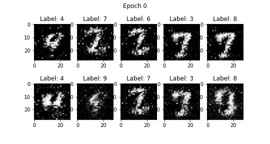
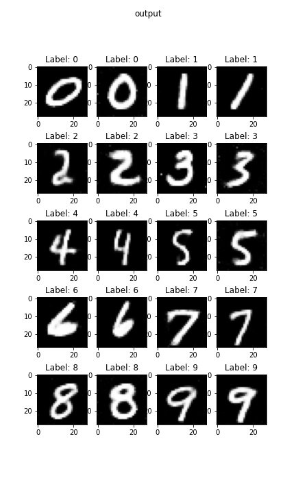

# Conditional Generative Adversarial Nets

 

- **Author** : Mehdi Mirza, Simon Osindero
- [paper link](https://arxiv.org/abs/1411.1784)

 

## Abstract

 

Generative Adversarial Nets [8] were recently introduced as a novel way to train generative models. In this work we introduce the conditional version of generative adversarial nets, which can be constructed by simply feeding the data, y, we wish to condition on to both the generator and discriminator. We show that this model can generate MNIST digits conditioned on class labels. We also illustrate how this model could be used to learn a multi-modal model, and provide preliminary examples of an application to image tagging in which we demonstrate how this approach can generate descriptive tags which are not part of training labels.

 

## Environment

 

- Python : 3.8.10
- Pytorch : 1.7.1

 

## Output

 

**In Training**

 

 

**Output**

